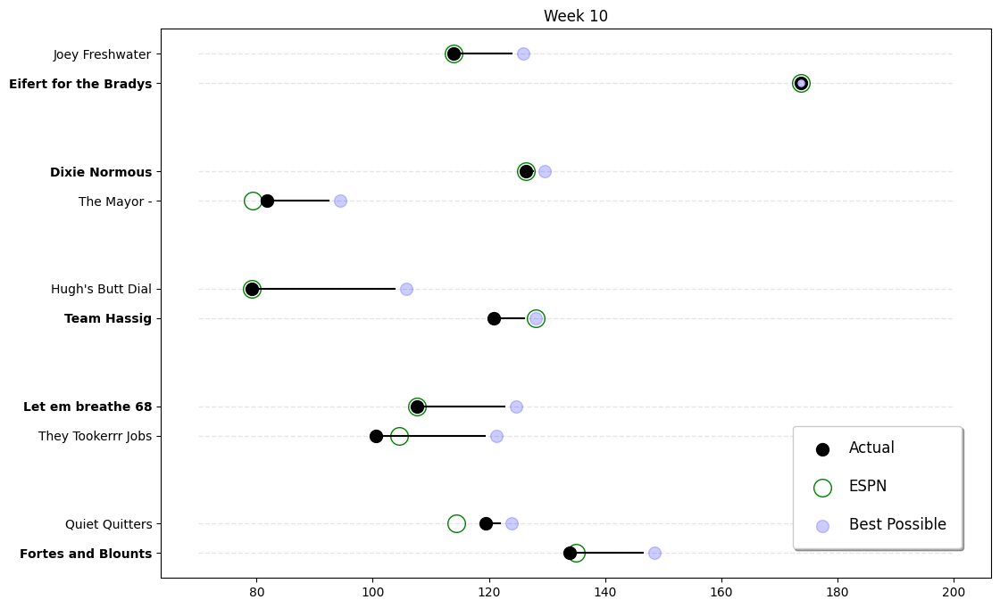

### Summary

This was a week of upsets! Chris Donovan finally pulled out a win against Nick Meyer. Meyer's team name, Quiet Quitters, is very fitting as they have now quit on the season. Trevor Donovan squeaked out a win against Bill Joyner. Joyner's team is also done for the season. David Mitchell had a huge week, scoring 173 points to beat tyler osteen. Brian Nevill's team got their asses handed to them by Nick Hassig.

In the standings, Trevor Donovan and Alan Dukes are still in the lead with 7 wins each. David Mitchell has pulled into a tie for third place with Chris Donovan. Lee Arthur and Brian Nevill are both still in contention for the final playoff spot with 5 wins each.  *- Fake Commish*

___

### Weekly Awards

#### Big Dick Award (Most Total Points) $$
David Mitchell 173.68 

#### Little Bitch Award (Fewest Total Points)
Brian Nevill 79.1 

___

### Matchups Overview

**Best and Worst for the Week**

| Category              | Owner          |
|-----------------------|----------------|
| Most Points Scored:   | David Mitchell |
| Least Points Scored:  | Brian Nevill   |
| Best Possible Lineup: | David Mitchell |
| Best Lineup Setter    | David Mitchell |
| Worst Lineup Setter   | Brian Nevill   |
| Lucky Winners         | Lee Arthur     |
| Unlucky Losers        | Nick Meyer     |

**Best and Worst Positions for the Week**

| Category              | Owner            |
|-----------------------|------------------|
| Best QBs:             | David Mitchell   |
| Best RBs:             | Alan Dukes       |
| Best WRs:             | David Mitchell   |
| Best TEs:             | Nick Meyer       |
| Best DST:             | tyler osteen     |
| Best K:               | Nick Meyer       |
| Best Bench:           | Chris Donovan    |
| --------------------- | ---------------- |
| Worst QBs:            | tyler osteen     |
| Worst RBs:            | Nick Meyer       |
| Worst WRs:            | Brian Nevill     |
| Worst TEs:            | Nick Hassig      |
| Worst DST:            | Chris Donovan    |
| Worst K:              | tyler osteen     |
| Worst Bench:          | Nick Hassig      |

