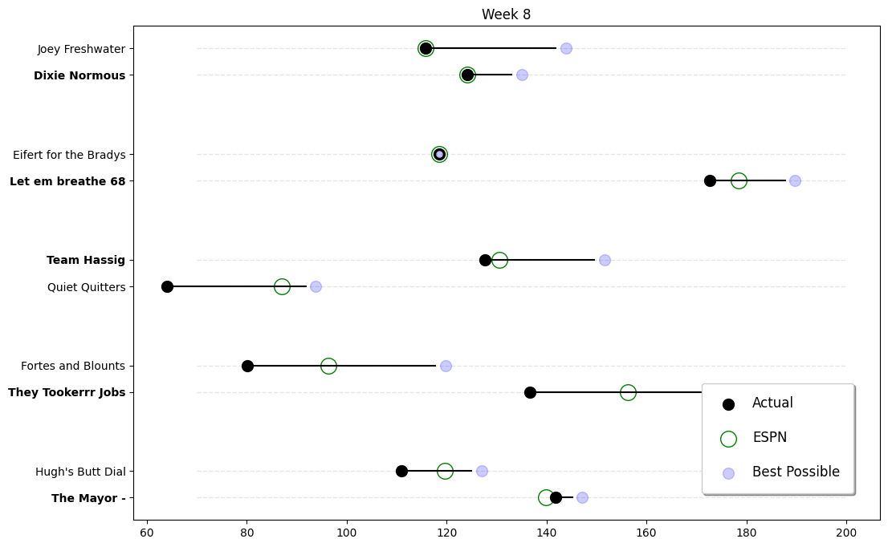

### Summary

It was a great week for the bottom of the standings as Bill, Nick H., and David all won their matchups. Tyler and Chris also had solid performances but came up short. Trevor and Alan both had big weeks and remain at the top of the standings. Brian Nevill got his butt handed to him by Bill Joyner. Literally.

Week Data:
WEEK 11 MATCHUPS
- Trevor Donovan (Dixie Normous) scored 119.98 to beat BILL JOYNER (The Mayor ) who scored 87.76.
- Chris Donovan (Fortes and Blounts) scored 138.14 to beat Brian Nevill (Hugh's Butt Dial) who scored 97.9.
- David Mitchell (Eifert for the Bradys) scored 87.48 to lose to Lee Arthur (Let em breathe 68) who scored 106.9.
- Nick Hassig (Team Hassig) scored 132.1 to beat Nick Meyer (Quiet Quitters) who scored 101.7.
- Stephen Routh (Boner Champ) scored 174.86 to beat Alan Dukes (They Tookerrr Jobs) who scored 161.14.

WEEK 11 STANDINGS
place. owner. wins-losses. playoff chance.
1. Trevor Donovan. 9-2. 99%.
2. Alan Dukes. 8-3 95%.
3. Brian Nevill 7-4 79%.
4. Stephen Routh 7-4 61%.
5. Lee Arthur 6-5 30%.
6. David Mitchell 5-6 13%.
7. Nick Meyer 4-7 5%.
8  Nick Hassig 4-7 5%.
9  BILL JOYNER 2-9 0%.
10 Chris Donovan 2-9 0%.

 Summary: It was a great week for the bottom of the standings as Bill, Chris, and David all won their matchups.. Trevor continued his winning ways with another strong performance against Bill Joyner.. Stephen also had a big week, scoring 174 points to beat Alan Dukes..  *- Fake Commish*

___

### Weekly Awards

#### Big Dick Award (Most Total Points) $$
Lee Arthur 172.7 

#### Little Bitch Award (Fewest Total Points)
Nick Meyer 64.1 

___

### Matchups Overview

**Best and Worst for the Week**

| Category              | Owner          |
|-----------------------|----------------|
| Most Points Scored:   | Lee Arthur     |
| Least Points Scored:  | Nick Meyer     |
| Best Possible Lineup: | Lee Arthur     |
| Best Lineup Setter    | David Mitchell |
| Worst Lineup Setter   | Chris Donovan  |
| Lucky Winners         | --             |
| Unlucky Losers        | --             |

**Best and Worst Positions for the Week**

| Category              | Owner            |
|-----------------------|------------------|
| Best QBs:             | Lee Arthur       |
| Best RBs:             | Lee Arthur       |
| Best WRs:             | BILL JOYNER      |
| Best TEs:             | Trevor  Donovan  |
| Best DST:             | Alan Dukes       |
| Best K:               | Alan Dukes       |
| Best Bench:           | Alan Dukes       |
| --------------------- | ---------------- |
| Worst QBs:            | Chris Donovan    |
| Worst RBs:            | Trevor  Donovan  |
| Worst WRs:            | Nick Meyer       |
| Worst TEs:            | Chris Donovan    |
| Worst DST:            | Brian Nevill     |
| Worst K:              | tyler osteen     |
| Worst Bench:          | David Mitchell   |

