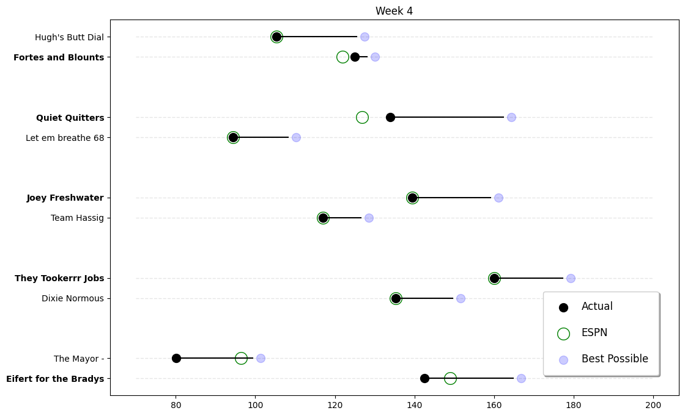

### Summary

BILL got his ass kicked by David this week. BILL is really starting to look like a one-hit wonder. Trevor put up a good fight against Alan, but came up just short. Tyler had a big win against Nick H. to get back to .500 on the year. Lee and Brian both suffered tough losses.

Overall, it was a bad week for the ACC teams as they all went 1-3. Trevor and Alan are still looking good at 3-1, but the rest of the ACC teams are struggling. David is looking like the front runner right now.

___

### Weekly Awards

#### Big Dick Award (Most Total Points) $$
Alan Dukes 160.08 

#### Little Bitch Award (Fewest Total Points)
BILL JOYNER 80.12 

___

### Matchups Overview

Unlucky Losers:
* Trevor Donovan

**Best and Worst for the Week**

**Best and Worst Positions for the Week**

